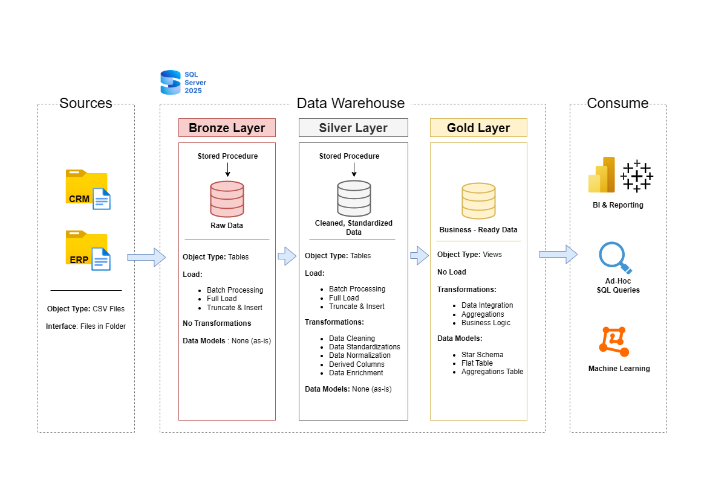

# Data Warehouse and Analytics Project

Selamat datang di repository Data Warehouse and Analytics Project! 🚀

Proyek ini menunjukkan solusi data warehousing dan analytics secara end-to-end, mulai dari membangun data warehouse hingga menghasilkan insight yang actionable. Proyek ini menyoroti penerapan best practice industri dalam data engineering dan analytics.

## 🏗️ Data Architecture

Arsitektur data pada proyek ini mengikuti **Medallion Architecture** dengan layer Bronze, Silver, dan Gold:

- **Bronze Layer**: Menyimpan data mentah apa adanya dari sistem sumber. Data diambil dari file CSV ke dalam SQL Server Database.
- **Silver Layer**: Layer ini mencakup proses data cleansing, standardisasi, dan normalisasi untuk mempersiapkan data agar siap dianalisis.
- **Gold Layer**: Berisi data yang siap digunakan untuk kebutuhan bisnis, dimodelkan ke dalam star schema untuk kebutuhan reporting dan analytics.

## 📖 Project Overview

Proyek ini mencakup:

- **Data Architecture**: Merancang Data Warehouse modern menggunakan Medallion Architecture (Bronze, Silver, Gold).
- **ETL Pipelines**: Melakukan extract, transform, dan load data dari sistem sumber ke dalam data warehouse.
- **Data Modeling**: Mengembangkan fact table dan dimension table yang dioptimalkan untuk query analitis.
- **Analytics & Reporting**: Membuat laporan dan dashboard berbasis SQL untuk menghasilkan insight bisnis.

Proyek ini merupakan implementasi keahlian di bidang:

- SQL Development
- Data Architecture
- Data Engineering
- ETL Pipeline Development
- Data Modeling
- Data Analytics

## 🛠️ Tools yang Digunakan

- **SQL Server Express** — server database untuk hosting data warehouse
- **SQL Server Management Studio (SSMS)** — GUI untuk mengelola dan berinteraksi dengan database
- **Git** — version control dan kolaborasi kode
- **Draw.io** — mendesain arsitektur data, data model, data flow, dan diagram

## 🚀 Project Requirements

### Membangun Data Warehouse (Data Engineering)

**Objective**

Mengembangkan data warehouse modern menggunakan SQL Server untuk mengonsolidasikan data penjualan, guna mendukung reporting analitis dan pengambilan keputusan.

**Spesifikasi**

- **Data Sources**: Mengimpor data dari dua sistem sumber (ERP dan CRM) dalam bentuk file CSV.
- **Data Quality**: Membersihkan dan menyelesaikan masalah kualitas data sebelum dianalisis.
- **Integration**: Menggabungkan kedua sumber data ke dalam satu data model yang user-friendly dan dirancang untuk query analitis.
- **Scope**: Fokus pada dataset terbaru saja; historisasi data tidak diperlukan.
- **Documentation**: Menyediakan dokumentasi data model yang jelas untuk mendukung pihak bisnis maupun tim analytics.

### BI: Analytics & Reporting (Data Analysis)

**Objective**

Mengembangkan analytics berbasis SQL untuk menghasilkan insight mendalam terkait:

- Customer Behavior
- Product Performance
- Sales Trends

Insight ini membantu stakeholder memahami metrik bisnis utama untuk mendukung pengambilan keputusan strategis.

## 📂 Repository Structure

```
data-warehouse-project/
│
├── datasets/                           # Dataset mentah yang digunakan (data ERP dan CRM)
│
├── docs/                               # Dokumentasi proyek dan detail arsitektur
│   ├── etl.drawio                      # Diagram teknik dan metode ETL
│   ├── data_architecture.drawio        # Diagram arsitektur proyek
│   ├── data_catalog.md                 # Katalog dataset, deskripsi field, dan metadata
│   ├── data_flow.drawio                # Diagram alur data
│   ├── data_models.drawio              # Diagram data model (star schema)
│   ├── naming-conventions.md           # Panduan penamaan tabel, kolom, dan file
│
├── scripts/                            # Script SQL untuk ETL dan transformasi
│   ├── bronze/                         # Script ekstraksi dan load data mentah
│   ├── silver/                         # Script cleansing dan transformasi data
│   ├── gold/                           # Script pembuatan model analitis
│
├── tests/                              # Script pengujian dan kualitas data
│
├── README.md                           # Overview dan instruksi proyek
├── LICENSE                             # Informasi lisensi repository
└── .gitignore                          # File dan direktori yang diabaikan Git
```

## 🛡️ License

Proyek ini dilisensikan di bawah **MIT License**. Bebas digunakan, dimodifikasi, dan dibagikan dengan atribusi yang sesuai.
